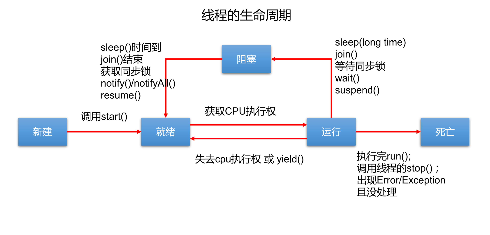

## 并行与并发
- 多个CPU同时执行多个任务。比如：多个人同时做不同的事
- 一个CPU(采用时间片)同时执行多个任务。比如：秒杀、多个人做同一件事

## 线程的创建方式
- 继承Thread类重写run()方法，创建子类对象，调用start()方法
- 实现Runnable接口，重写run()方法，构建此类对象传入Thread类的构造器中，调用start()方法
   - 优先选择：实现Runnable接口的方式
        - 实现的方式没有类的单继承性的局限性
        - 实现的方式更适合来处理多个线程有共享数据的情况
- 实现Callable接口。 ---JDK5.0新增
- 使用线程池
  - 提高响应速度（减少了创建新线程的时间）
  - 降低资源消耗（重复利用线程池中线程，不需要每次都创建）
  - 便于线程管理 (ThreadPoolExecutor)Executors.newFixedThreadPool(int nThreads)

## 线程的常用方法
- start():启动当前线程；调用当前线程的run()方法
- run():通常需要重写Thread类中的此方法，将创建的线程执行的操作声明在此方法中
- currentThread():静态方法，返回执行当前代码的线程
- getName():获取当前线程的名字
- setName():设置当前线程的名字
- yield():释放当前CPU的执行权
- join():在线程A中调用线程B的join(),此时线程A就进入阻塞状态，直到线程B完全执行完以后，线程A才结束阻塞状态
- stop():已过时。当执行此方法时，强制结束当前线程。
- sleep(long millitime):让线程"睡眠"指定的millitime毫秒。在指定的millitime毫秒时间内，当前线程是阻塞状态。
- isAlive():判断线程是否存活

## 实现线程同步的方式(如何解决线程安全问题？有几种方式？)
- 同步代码块,synchronized(同步监视器)
  - 在实现Runnable接口创建多线程的方式中，我们可以考虑使用this充当同步监视器
  - 在继承Thread类创建多线程的方式中，慎用this充当同步监视器，考虑使用当前类充当同步监视器
- 同步方法,synchronized
  - 非静态的同步方法，同步监视器是：this
  - 静态的同步方法，同步监视器是：当前类本身

## 线程的生命周期

## synchronized与lock的区别
- 相同点
  - 二者都可以解决线程安全问题
- 不同点
  - synchronized机制自动在执行完相应的同步代码后，自动的释放同步监视器
  - lock需要手动的启动同步(lock()),结束同步时也需要手动的实现(unlock())

## sleep()和wait()的异同？
- 相同点
  - 一旦执行方法，都可以使得当前的线程进入阻塞状态。
- 不同点：
  - 两个方法声明的位置不一样：Thread类中声明静态sleep()方法，Object类中声明wait()
  - 调用要求不同：sleep()可以在任何需要的场景下调用。wait()必须使用在同步代码块或同步方法中。
  - 关于是否释放同步监视器：如果两个方法都是用在同步代码块或同步方法中，sleep()方法不会释放锁，wait()会释放锁。
  
## 使用线程池的好处
- 提高响应速度
- 降低资源消耗
- 便于线程管理

## String str1 = "abc"; 与 String str2 = new String("abc");的区别
- 字面量方式赋值，abc存放在方法区的字符串常量池中
- 一个堆空间中new结构，另一个是char[]对应的常量池中的数据："abc"

## String、StringBuffer、StringBuilder的区别
- 相同点
  - 底层都是char型数组
- 不同点
  - String：不可变的字符序列
  - StringBuffer：可变的字符序列；线程安全的，效率低。
    - 空参构造器new的话<====>底层创建了一个长度是16的数组
    - public StringBuffer(String str)<=====>底层创建了一个str.length()+16的数组
      - 默认情况下，扩容为原来容量的2倍+2，同时将原有数组中的元素复制到新的数组中。
  - StringBuilder：可变的字符序列；JDK5.0新增，线程不安全的，效率高

## Comparable接口与Comparator的使用的对比：
- Comparable接口的方式一旦一定，保证Comparable接口实现类的对象在任何位置都可以比较大小。
- Comparator接口属于临时性的比较。

## 数组与集合的区别与联系
- 数组
  - 特点
    - 一旦初始化以后，其长度就确定了
    - 数组一旦定义好，其元素的类型也就确定了
  - 缺点
    - 一旦初始化以后，其长度就不可修改
    - 数组中提供的方法非常有限，对于添加、删除、插入数据等操作，非常不便，同时效率不高
    - 获取数组中实际元素的个数的需求，数组没有现成的属性或方法可用
    - 数组存储数据的特点：有序、可重复。对于无序、不可重复的需求，不能满足

## ArrayList、LinkedList、Vector的异同点
- 相同点
  - 三个类都实现了List接口，存储数据的特点相同：存储有序的、可重复的数据
- 不同点
  - ArrayList:作为List接口的主要实现类；线程不安全的，效率高；底层使用Object[] elementData存储
  - LinkedList:对于频繁的插入、删除操作，使用此类效率比ArrayList高，底层使用双向链表存储
  - Vector:作为List接口的古老实现类；线程安全的，效率低；底层使用Object[] elementData存储
  
## HashMap的底层实现原理
- JDK7:数组+链表
- JDK8:数组+链表+红黑树

## HashMap在JDK7和JDK8中的异同
- new HashMap()：底层没有创建一个长度为16的数组
- jdk8底层的数组是：Node[],而非Entry[],首次调用put()方法时，底层创建长度为16的数组
- jdk7底层结构只有数组+链表。jdk8中底层结构：数组+链表+红黑树。
- 当数组的某一个索引位置上的元素以链表形式存在的数据个数 > 8 且当前数组的长度 > 64,此时此索引位置上的所有数据采用红黑树存储

## HashMap和HashTable的异同？
- 相同点
  - 底层都是Entry类型的数组

- 不同点
  - HashMap线程不安全的，效率高,HashTable线程安全的，效率低
  - HashMap存储null的key和value的键值对,HashTable不能存储null的key和value的键值对

## 谈谈你对HashMap中put/get方法的认识？如果了解再谈谈HashMap的扩容机制？默认大小是多少？什么是负载因子(或填充比)？什么是吞吐临界值(或阈值、threshold)？

## 负载因子值的大小，对HashMap有什么影响
- 负载因子的大小决定了HashMap的数据密度。
- 负载因子越大密度越大，发生碰撞的几率越高，数组中的链表越容易长,造成查询或插入时的比较次数增多，性能会下降。
- 负载因子越小，就越容易触发扩容，数据密度也越小，意味着发生碰撞的几率越小，数组中的链表也就越短，查询和插入时比较的次数也越小，性能会更高。但是会浪费一定的内容空间。而且经常扩容也会影响性能，建议初始化预设大一点的空间。
- 按照其他语言的参考及研究经验，会考虑将负载因子设置为0.7~0.75，此时平均检索长度接近于常数